# Apptics Android SDK — Sample App

A Jetpack Compose sample that demonstrates **every Apptics SDK feature** in one runnable app.
Each feature has its own screen with live state, a "Run" button that calls the real SDK API, and a
copy-pasteable code snippet so you can drop the same call into your own project.

- **Package:** `com.zoho.apptics.sample`
- **Apptics BOM:** `0.3.16` · **Apptics Gradle plugin:** `0.2.6-beta`
- **minSdk:** 24 ·

---

## Contents

- [Screenshots](#screenshots)
- [Features showcased](#features-showcased)
- [Prerequisites](#prerequisites)
- [Setup & Configuration Guide](#setup--configuration-guide)
- Features:
  [Identify User](#identify-user) ·
  [Analytics](#analytics) ·
  [Crash Tracking](#crash-tracking) ·
  [Remote Logging](#remote-logging) ·
  [In-App Ratings](#in-app-ratings) ·
  [In-App Updates](#in-app-updates) ·
  [Cross-Promotion](#cross-promotion) ·
  [In-App Feedback](#in-app-feedback) ·
  [Remote Config](#remote-config) ·
  [API Tracking](#api-tracking)
- [Project structure](#project-structure)
- [Troubleshooting & notes](#troubleshooting--notes)
- [Learn more](#learn-more)

---

## Screenshots

| | | |
|:--:|:--:|:--:|
| 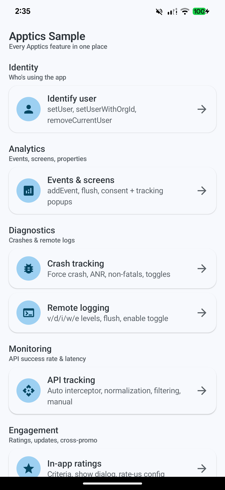<br>**Home** | 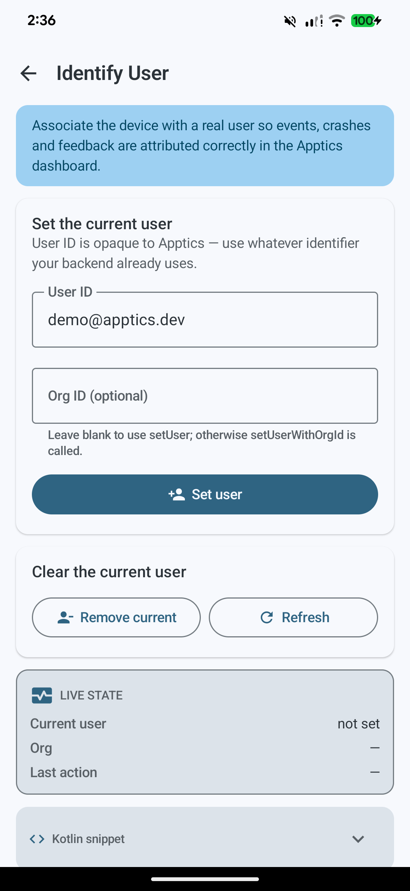<br>**Identify User** | 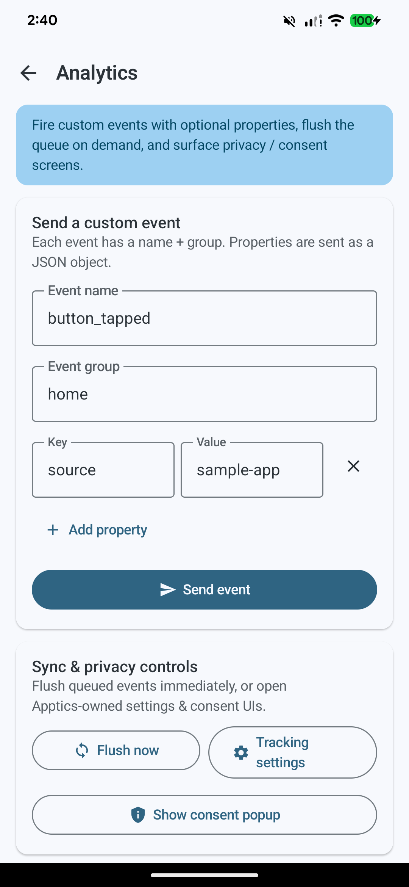<br>**Analytics** |
| 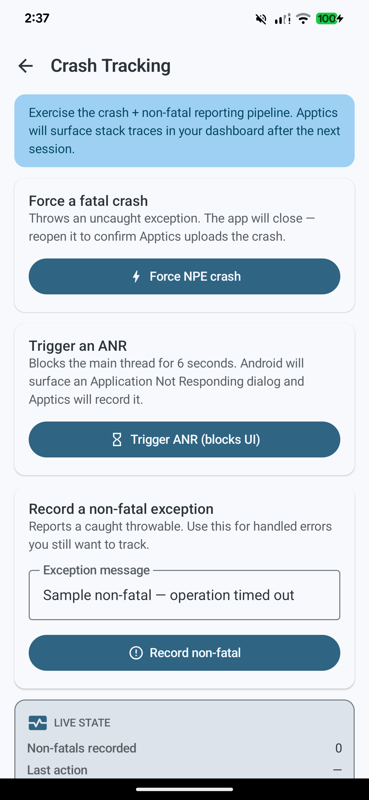<br>**Crash Tracking** | 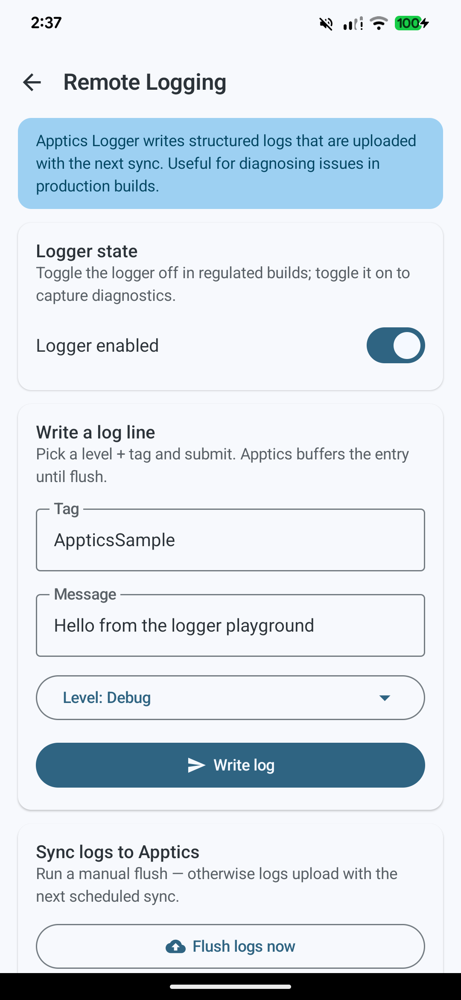<br>**Remote Logging** | 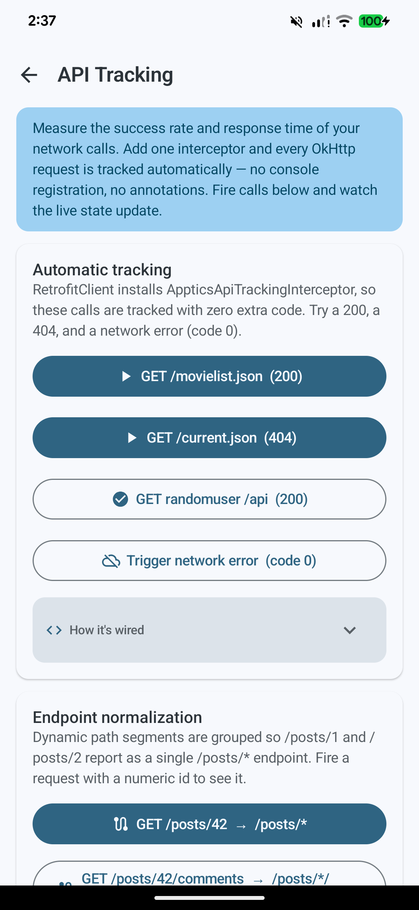<br>**API Tracking** |
| 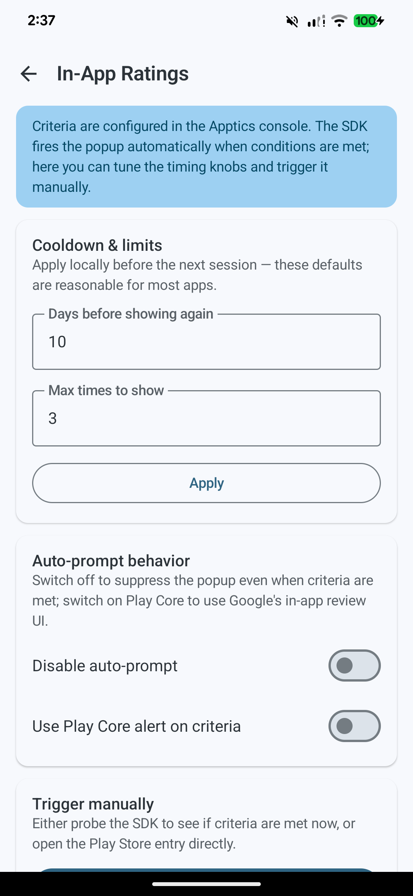<br>**In-App Ratings** | 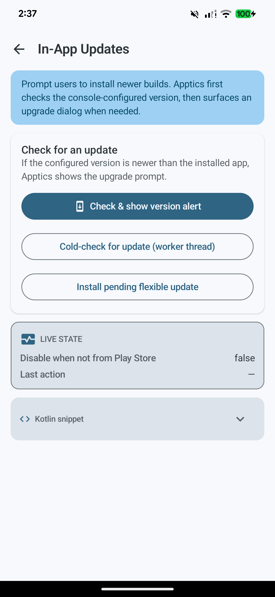<br>**In-App Updates** | 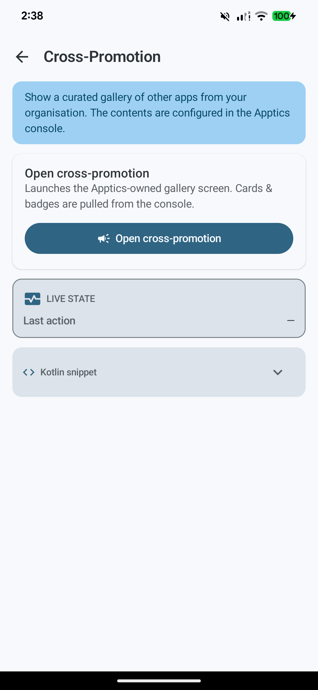<br>**Cross-Promotion** |
| 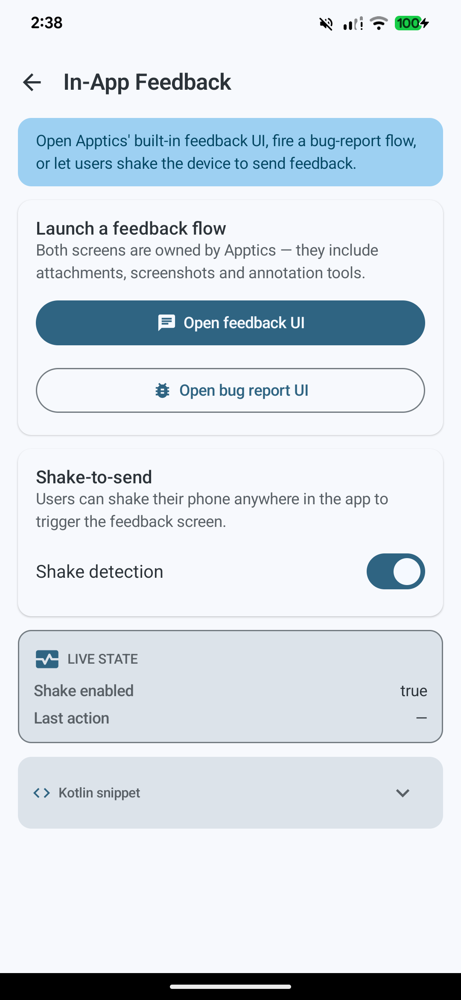<br>**In-App Feedback** | 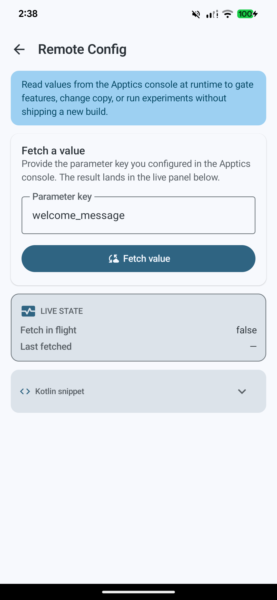<br>**Remote Config** | |

---

## Features showcased

| Group | Screen | Apptics APIs |
|-------|--------|--------------|
| Identity | Identify user | `setUser`, `setUserWithOrgId`, `removeCurrentUser` |
| Analytics | Events & screens | `AppticsEvents.addEvent`, flush, consent/tracking popups |
| Diagnostics | Crash tracking | force crash, ANR, non-fatals, toggles |
| Diagnostics | Remote logging | `AppticsLogger.v/d/i/w/e`, flush, enable |
| Engagement | **In-app ratings** | `AppticsInAppRatings` |
| Engagement | **In-app updates** | `AppticsInAppUpdates` |
| Engagement | Cross-promotion | cross-promo gallery |
| Feedback | In-app feedback | feedback UI, bug report, shake-to-send |
| Configuration | Remote config | fetch values, conditions, defaults |
| Monitoring | API tracking | `AppticsApiTrackingInterceptor`, `AppticsApiTracker.configure`, manual `startTrackApi`/`endTrackApi` |

---

## Prerequisites

- **Android Studio**
- An **Apptics account** and a registered app on the [Apptics console](https://www.zoho.com/apptics/).
  The console is where you configure rating criteria, target update versions, remote-config values, etc.

---

## Setup & Configuration Guide

Five steps to get the sample running and to wire **In-App Rating** and **In-App Update** to your own
Apptics app. (The detailed API for every feature lives in the reference sections further down.)

### Step 1 — Get & open the project

```bash
git clone <this-repo-url>
cd native-sdk-sample
```

Open the folder in **Android Studio** (Hedgehog or newer) and let Gradle sync finish.

### Step 2 — Place your `apptics-config.json`

**Where it goes:** the **app-module root** — `app/apptics-config.json`, right next to
`app/build.gradle.kts`:

```
native-sdk-sample/
├── settings.gradle.kts
├── build.gradle.kts
└── app/
    ├── build.gradle.kts
    └── apptics-config.json   ←  put it here
```

**Where to get it:** Apptics console → your app → **Settings → SDK Integration** → download
`apptics-config.json`.


That's the only file you need to touch — the Gradle plugin reads it at build time and
`Apptics.init(this)` in `MyApp.kt` boots the SDK at launch. (See **How the SDK is wired** below if
you're copying the setup into your own project.)

### Step 3 — Run the app

```bash
./gradlew :app:installDebug      # build + install on a connected device/emulator
```

…or press **Run** in Android Studio. The home screen lists every feature grouped by category — tap a
card to open its demo screen.

### Step 4 — Configure In-App Rating

The rate-us popup is driven by **criteria you set on the console**; the app just shows it.

**(A) On the Apptics console** — go to **Developer → Growth → In-app rating**, pick your app/platform
from the dropdown, then click **Configure**. Set the criteria that decide *when* the popup appears:

- Pick the **app versions** the prompt should show on.
- Choose a **Mode**:
  - **Score-based** — users accumulate points from events, screens, and sessions until they reach a goal score.
  - **Hit-based** — users must perform actions (events / screens / sessions) a set number of times.
- Add **anchor points** to fire the prompt immediately on a specific event/screen, combine up to **5 criteria** with OR, then **Save**.

When a user meets the criteria, the SDK shows the popup automatically.

**(B) In code (optional)** — only if you want to tune the timing or trigger it yourself:

```kotlin
import com.zoho.apptics.rateus.AppticsInAppRatings

AppticsInAppRatings.daysBeforeShowingPopupAgain = 10   // cooldown after a dismissal
AppticsInAppRatings.maxTimesToShowPopup = 3            // lifetime cap per user

// Show now, but only if the console criteria are already satisfied:
AppticsInAppRatings.showPopupIfCriteriaFulfilled()
```

→ Full options in the [In-App Ratings](#in-app-ratings) reference below.

### Step 5 — Configure In-App Update

**(A) On the Apptics console** — go to **Developer → In-app update**, pick your app from the dropdown,
then click **Configure**. Then:

- Choose the **latest app version** to promote and a **minimum OS/SDK version**.
- Pick an **alert type**:
  - **Android Play Core** (Android 5.0+): **Flexible** (installs in the background while the app keeps running), **Immediate** (go to Play Store + restart), or **Force**.
  - **Apptics native / custom**: **Ignorable**, **Remind me**, or **Force update**.
- Download the sample `language.json`, fill in your alert messages (multi-language), and upload it; set reminder intervals (except for Force), preview, and **Publish**.

**(B) In code** — call the check from an `AppCompatActivity` (e.g. on launch or behind a "Check for
updates" button). If the console version is newer than the installed build, Apptics shows the upgrade
dialog:

```kotlin
import com.zoho.apptics.appupdates.AppticsInAppUpdates

// `this` must be an AppCompatActivity — MainActivity already is.
AppticsInAppUpdates.checkAndShowVersionAlert(this)
```

→ Cold-check and flexible-install APIs are in the [In-App Updates](#in-app-updates) reference below.

---

### How the SDK is wired (already done in this project)

You don't need to change any of this to run the sample — it's here for when you copy the setup into
your own app.

**`build.gradle.kts` (root)** pulls in the plugin from Zoho's Maven repo:

```kotlin
buildscript {
    repositories { maven(url = "https://maven.zohodl.com/"); mavenLocal() }
    dependencies { classpath(libs.apptics.plugin) }
}
```

**`settings.gradle.kts`** adds the Zoho Maven repo for both plugins and libraries:

```kotlin
maven(url = "https://maven.zohodl.com/")
```

**`app/build.gradle.kts`** applies the plugin and adds the feature modules via the Apptics BOM:

```kotlin
plugins { id("apptics-plugin") }

dependencies {
    implementation(platform(libs.apptics.bom))
    implementation(libs.apptics.analytics)
    implementation(libs.apptics.crash.tracker)
    implementation(libs.apptics.feedback)
    implementation(libs.apptics.ratings)     // In-app ratings
    implementation(libs.apptics.appupdates)  // In-app updates
    implementation(libs.apptics.logger)
    implementation(libs.apptics.rc)          // Remote config
    implementation(libs.apptics.crosspromo)
}
```

**`MyApp.kt`** initializes the SDK once, before any other Apptics call:

```kotlin
class MyApp : Application() {
    override fun onCreate() {
        super.onCreate()
        Apptics.init(this)        // must run before any other Apptics API
        AppticsLogger.enable()    // turn on remote logging
    }
}
```

> **Note:** `MainActivity` extends `AppCompatActivity`. Some Apptics dialogs (in-app updates,
> feedback) require an `AppCompatActivity` host — keep this if you copy the screens into your app.

---

## Identify User

Associate the device with a real user so events, crashes, and feedback are attributed correctly in
the Apptics dashboard. The user ID is opaque to Apptics — use whatever identifier your backend
already uses. Demo screen:
([`UserIdScreen.kt`](app/src/main/java/com/zoho/apptics/sample/ui/features/userid/UserIdScreen.kt)).

### API

```kotlin
import com.zoho.apptics.common.AppticsUser

// Set the current user.
AppticsUser.setUser(userId = "demo@apptics.dev")

// Set with an organization ID (if your backend models users under an org).
AppticsUser.setUserWithOrgId(userId = "demo@apptics.dev", orgId = "ACME-123")

// Clear the user — subsequent events become anonymous.
AppticsUser.removeCurrentUser()

// Read the current user. @WorkerThread — runs a blocking DB read, keep it off the main thread.
val info = AppticsUser.getCurrentUserInfo()
```

| Method | What it does |
|--------|--------------|
| `setUser(userId)` | Associates the device with a user. |
| `setUserWithOrgId(userId, orgId)` | Same, but also attaches an organization ID. |
| `removeCurrentUser()` | Dissociates the active user; events become anonymous until `setUser` is called again. |
| `getCurrentUserInfo()` | Returns the user currently attached to the device. **Worker thread only** (blocking DB read). |

📖 Docs: <https://www.zoho.com/apptics/resources/SDK/android-users.html>
📖 Full guide: [refer/users.md](refer/users.md)

---

## Analytics

Record custom events with optional properties, flush the upload queue on demand, and surface
Apptics' privacy / consent screens. Each event has a **name** and a **group**; properties are sent
as a JSON object for richer reporting on the console. Demo screen:
([`AnalyticsScreen.kt`](app/src/main/java/com/zoho/apptics/sample/ui/features/analytics/AnalyticsScreen.kt)).

### API

```kotlin
import com.zoho.apptics.analytics.AppticsAnalytics
import com.zoho.apptics.analytics.AppticsEvents
import org.json.JSONObject

// Simplest form — just a name + group.
AppticsEvents.addEvent(eventName = "button_tapped", eventGroup = "home")

// With custom properties attached as a JSON payload.
AppticsEvents.addEvent(
    eventName = "button_tapped",
    eventGroup = "home",
    customProperties = JSONObject().put("source", "sample-app")
)

// Force queued events to upload now instead of waiting for the sync window.
AppticsAnalytics.flush()

// Privacy / consent UIs (Apptics-owned screens).
AppticsAnalytics.openSettings(activity)
AppticsAnalytics.showReviewTrackingSettingsPopup(activity, showOnlyOnce = true)
```

| Method | What it does |
|--------|--------------|
| `AppticsEvents.addEvent(eventName, eventGroup)` | Records a custom event by name + group. |
| `AppticsEvents.addEvent(eventName, eventGroup, customProperties)` | Same, with a JSON object of custom properties. |
| `AppticsAnalytics.flush()` | Uploads queued events / engagement data immediately. |
| `AppticsAnalytics.openSettings(activity)` | Opens the screen where users toggle analytics / crash / personal-data tracking categories. |
| `AppticsAnalytics.showReviewTrackingSettingsPopup(activity, showOnlyOnce)` | Shows a consent dialog to review tracking preferences. `showOnlyOnce = true` prevents it from reappearing once acknowledged. |

📖 Docs: <https://www.zoho.com/apptics/resources/SDK/android-in_app_event.html> · [Consent](https://www.zoho.com/apptics/resources/SDK/android-consent.html)
📖 Full guide: [refer/analytics.md](refer/analytics.md)

---

## Crash Tracking

Apptics captures **fatal crashes and ANRs automatically** once the SDK is initialized — stack traces
appear in your dashboard on the next session. You can also record **non-fatal** (caught) exceptions
you still want to track. Demo screen:
([`CrashScreen.kt`](app/src/main/java/com/zoho/apptics/sample/ui/features/crash/CrashScreen.kt)).

### API

```kotlin
import com.zoho.apptics.crash.AppticsNonFatals

// Non-fatal: report a caught throwable you handled but still want to surface.
try {
    riskyCall()
} catch (t: Throwable) {
    AppticsNonFatals.recordException(t)
}

// Fatal: uncaught exceptions are picked up automatically — just let them propagate.
throw NullPointerException("forced crash")
```

| Method | What it does |
|--------|--------------|
| _(automatic)_ | Fatal crashes and ANRs are captured without any code once `Apptics.init()` has run. |
| `AppticsNonFatals.recordException(throwable)` | Records a caught throwable as a non-fatal for diagnostics. |

📖 Docs: <https://www.zoho.com/apptics/resources/SDK/android-crashreporting.html>
📖 Full guide: [refer/crash-tracking.md](refer/crash-tracking.md)

---

## Remote Logging

`AppticsLogger` writes structured logs that upload with the next sync — useful for diagnosing issues
in production builds. Log lines are buffered locally until a sync (or a manual flush). Calls are
no-ops while the logger is disabled. Demo screen:
([`LoggingScreen.kt`](app/src/main/java/com/zoho/apptics/sample/ui/features/logging/LoggingScreen.kt)).

### API

```kotlin
import com.zoho.apptics.logger.AppticsLogger

// Globally enable / disable the remote logger.
AppticsLogger.enable()
AppticsLogger.disable()
val on = AppticsLogger.isEnabled()

// Write a log line at a level (v / d / i / w / e), with a tag + message.
AppticsLogger.d("AppticsSample", "Hello from the playground")
AppticsLogger.e("AppticsSample", "Something went wrong", throwable)

// Push buffered entries to Apptics now. Suspend function — call from a coroutine.
lifecycleScope.launch { AppticsLogger.flushLogs() }
```

| Method | What it does |
|--------|--------------|
| `enable()` / `disable()` | Turns the remote logger on / off globally. |
| `isEnabled()` | Returns whether the logger is currently on. |
| `v / d / i / w / e(tag, message)` | Writes a log line at Verbose / Debug / Info / Warning / Error. An optional `throwable` can be attached. |
| `flushLogs()` | Uploads buffered log entries immediately. **Suspend function** — call from a coroutine. |

> The sample calls `AppticsLogger.enable()` in [`MyApp.onCreate()`](app/src/main/java/com/zoho/apptics/sample/MyApp.kt) so logging is on from launch.

📖 Docs: <https://www.zoho.com/apptics/resources/SDK/android-remote_logger.html>
📖 Full guide: [refer/remote-logging.md](refer/remote-logging.md)

---

## In-App Ratings

Prompt users to rate your app once they hit engagement criteria you define on the Apptics console
(event count, screen visits, session count, etc.). The SDK shows the popup **automatically** when
those criteria are met; the demo screen
([`RatingsScreen.kt`](app/src/main/java/com/zoho/apptics/sample/ui/features/ratings/RatingsScreen.kt))
lets you tune the timing knobs and trigger it manually.

### API

```kotlin
import com.zoho.apptics.rateus.AppticsInAppRatings

// Cooldown & limits — how long to wait before re-prompting, and the lifetime cap.
AppticsInAppRatings.daysBeforeShowingPopupAgain = 10
AppticsInAppRatings.maxTimesToShowPopup = 3

// Auto-prompt behavior
AppticsInAppRatings.disableAutoPromptOnFulFillingCriteria = false  // true = you must trigger it yourself
AppticsInAppRatings.showAndroidPlayCoreAlertOnFulFillingCriteria = false  // true = use Google Play in-app review UI

// Trigger manually: shows the popup only if console criteria are satisfied for this user.
AppticsInAppRatings.showPopupIfCriteriaFulfilled()

// Or send the user straight to the Play Store entry, bypassing criteria entirely.
AppticsInAppRatings.openStore(activity)
```

| Property / method | What it does |
|-------------------|--------------|
| `daysBeforeShowingPopupAgain` | Days to wait before re-prompting after a dismissal. |
| `maxTimesToShowPopup` | Lifetime cap on how many times the popup appears for one user. |
| `disableAutoPromptOnFulFillingCriteria` | When `true`, the SDK won't auto-show the popup — call `showPopupIfCriteriaFulfilled()` yourself. |
| `showAndroidPlayCoreAlertOnFulFillingCriteria` | When `true`, delegates to Google Play Core's in-app review UI instead of the Apptics popup. |
| `showPopupIfCriteriaFulfilled()` | Asks the SDK if criteria are met now; shows the rate-us popup if so. |
| `openStore(activity)` | Opens your app's Play Store page directly. |

📖 Docs: <https://www.zoho.com/apptics/resources/SDK/android-in_app_rating.html>
📖 Full guide: [refer/in-app-ratings.md](refer/in-app-ratings.md)

---

## In-App Updates

Prompt users to install a newer build. Apptics checks the **target version configured on the
console** against the installed build and surfaces an upgrade dialog when an update is available.
Demo screen:
([`UpdatesScreen.kt`](app/src/main/java/com/zoho/apptics/sample/ui/features/updates/UpdatesScreen.kt)).

### API

```kotlin
import com.zoho.apptics.appupdates.AppticsInAppUpdates

// Standard entry point — checks the console version and shows the upgrade dialog if needed.
// Requires an AppCompatActivity.
AppticsInAppUpdates.checkAndShowVersionAlert(activity)

// Force a fresh network check, bypassing cached update info. @WorkerThread — keep off the main thread.
val data = AppticsInAppUpdates.coldCheckForUpdate()

// After a Play Core *flexible* update finishes downloading, run the install step.
AppticsInAppUpdates.installFlexibleUpdate()
```

| Method / property | What it does |
|-------------------|--------------|
| `checkAndShowVersionAlert(activity)` | Checks the console-configured target version and shows the upgrade dialog if an update exists. |
| `coldCheckForUpdate()` | Bypasses the cache and hits the network directly. **Worker thread only.** Returns update info or `null`. |
| `installFlexibleUpdate()` | Triggers the install after a flexible update has downloaded. No-op if nothing is queued. |
| `disableIfNotInstalledFromPlayStore` | When `true`, suppresses update prompts for builds not installed from the Play Store. |

> Run `coldCheckForUpdate()` off the main thread (e.g. inside a `Thread { ... }` or coroutine on
> `Dispatchers.IO`) — it makes a blocking network call.

📖 Docs: <https://www.zoho.com/apptics/resources/SDK/android-in_app_update.html>
📖 Full guide: [refer/in-app-updates.md](refer/in-app-updates.md)

---

## In-App Feedback

Let users send feedback or bug reports from inside the app. Apptics owns the feedback UI — it
includes a composer, attachments, screenshots/annotation tools, and auto-collected diagnostics.
Users can also **shake the device** anywhere in the app to open the feedback screen. Demo screen:
([`FeedbackScreen.kt`](app/src/main/java/com/zoho/apptics/sample/ui/features/feedback/FeedbackScreen.kt)).

### API

```kotlin
import com.zoho.apptics.feedback.AppticsFeedback

// Launch the Apptics-owned feedback screen (composer + attachments + diagnostics).
AppticsFeedback.openFeedback(activity)

// Bug-report variant: auto-captures a screenshot and opens the annotation editor.
AppticsFeedback.reportBug(activity)

// Shake-to-feedback
if (AppticsFeedback.isShakeForFeedbackEnabled()) {
    AppticsFeedback.disableShakeForFeedback()
} else {
    AppticsFeedback.enableShakeForFeedback()
}
```

| Method | What it does |
|--------|--------------|
| `openFeedback(activity)` | Opens the feedback screen (composer, attachments, auto-collected diagnostics). |
| `reportBug(activity)` | Variant that auto-captures a screenshot and opens it in the annotation editor. May not exist on older SDK versions — fall back to `openFeedback`. |
| `enableShakeForFeedback()` | Registers a shake listener; a strong shake opens the feedback screen automatically. |
| `disableShakeForFeedback()` | Turns shake detection off. |
| `isShakeForFeedbackEnabled()` | Returns whether shake-to-feedback is currently on. |

📖 Docs: <https://www.zoho.com/apptics/resources/SDK/android-in_app_feedback.html>
📖 Full guide: [refer/in-app-feedback.md](refer/in-app-feedback.md)

---

## Remote Config

Read values from the Apptics console at runtime to gate features, change copy, or run experiments
without shipping a new build. `fetchValue` returns the offline cached value first (if any), then
refreshes from the server; the `onComplete` callback fires with the final value on the main thread.
Demo screen:
([`RemoteConfigScreen.kt`](app/src/main/java/com/zoho/apptics/sample/ui/features/remoteconfig/RemoteConfigScreen.kt)).

**On the console** — **Developer → Remote configuration**: add a **parameter** (key + default value),
optionally create **conditions** (by device type, OS / app version, country, or custom key-values) and
attach them to the parameter, then **Preview & publish**. The first condition that evaluates true wins.
Don't store any sensitive data / PII in parameters.

### API

```kotlin
import com.zoho.apptics.remoteconfig.AppticsRemoteConfig

// Fetch a parameter by the key you configured on the console.
AppticsRemoteConfig.fetchValue("welcome_message") { value ->
    val message = value ?: "Welcome!"   // fall back to a default if no value
    // use `message` to drive UI
}
```

| Method | What it does |
|--------|--------------|
| `fetchValue(paramName, onComplete)` | Fetches a console-configured value by key. Serves the cached value first, then refreshes; `onComplete(value)` fires on the main thread with the final value (or `null`). |

📖 Docs: <https://www.zoho.com/apptics/resources/SDK/android-remote_configuration.html>
📖 Full guide: [refer/remote-config.md](refer/remote-config.md)

---

## API Tracking

Measure the success rate and response time of your network calls. Tracking is now **fully automatic** —
add one interceptor and every OkHttp request is tracked, with **no** web-console registration, `@TrackApiWith`
annotations, or numeric `apiId`. Dynamic path segments (numeric IDs, UUIDs, JWTs) are normalized to `*`, so
`/users/123` and `/users/456` are grouped as a single `/users/*` endpoint. Demo screen:
([`ApiTrackingScreen.kt`](app/src/main/java/com/zoho/apptics/sample/ui/features/apitracking/ApiTrackingScreen.kt)).

### Automatic tracking

Add `AppticsApiTrackingInterceptor` to your `OkHttpClient` — that's all (see
[`RetrofitClient.kt`](app/src/main/java/com/zoho/apptics/sample/network/RetrofitClient.kt)):

```kotlin
import com.zoho.apptics.analytics.AppticsApiTrackingInterceptor

val client = OkHttpClient.Builder()
    .addInterceptor(AppticsApiTrackingInterceptor())
    .build()
```

### Configuring what's tracked

`AppticsApiTracker.configure {}` (called once at startup — see
[`MyApp.onCreate()`](app/src/main/java/com/zoho/apptics/sample/MyApp.kt)) controls filtering and
normalization. Each call replaces the previous config entirely.

```kotlin
import com.zoho.apptics.analytics.AppticsApiTracker

AppticsApiTracker.configure {
    allowOnlyDomains("api.yourapp.com", "api.yourapp.in") // or ignoreDomains(...) / TLD filters
    groupDomains("api.yourapp.*")                         // merge regional domains
    ignoreEndpoint("/health", "/internal/**")             // skip noise endpoints
    addPattern("/v2/catalog/{categoryId}/items/{itemId}") // explicit pattern beats auto-detection
    preserveSegments("v1", "v2")                          // never normalize these to *
}
```

### Manual tracking (non-OkHttp clients)

```kotlin
val trackId = AppticsApiTracker.startTrackApi(url, "GET")
// ... make your network call ...
AppticsApiTracker.endTrackApi(trackId, responseCode, responseMessage)
```

`startTrackApi` returns `-1` if the URL is filtered out; `endTrackApi` is a no-op on `-1`, so no guard code is needed.

| Method | What it does |
|--------|--------------|
| `AppticsApiTrackingInterceptor()` | OkHttp interceptor that auto-tracks every request. |
| `AppticsApiTracker.configure { … }` | Sets domain/endpoint filtering and path normalization. |
| `startTrackApi(url, method)` | Manually opens a timing window; returns a per-call track ID (`-1` = filtered). |
| `endTrackApi(trackId, code, message)` | Closes the window with the HTTP status + message. |

> **Migration:** the `@TrackApiWith` annotation and `startTrackApi(apiId: Long, …)` are deprecated but
> still work. The [`network/multidomain/`](app/src/main/java/com/zoho/apptics/sample/network/multidomain)
> package is kept only as a backward-compatibility example.

📖 Docs: <https://www.zoho.com/apptics/resources/SDK/android-api_tracking.html>
📖 Full guide: [refer/api-tracking.md](refer/api-tracking.md)

---

## Project structure

```
app/src/main/java/com/zoho/apptics/sample/
├── MyApp.kt                     # Application — Apptics.init()
├── MainActivity.kt              # Compose host (AppCompatActivity)
├── ui/
│   ├── home/HomeScreen.kt       # Feature catalog
│   ├── navigation/              # Routes + NavGraph
│   ├── components/              # Reusable UI (SectionCard, RunButton, CodeBlock, …)
│   └── features/
│       ├── ratings/             # In-app ratings demo
│       ├── updates/             # In-app updates demo
│       ├── analytics/  crash/  logging/  feedback/
│       ├── remoteconfig/  crosspromo/  userid/
└── network/                     # Retrofit clients (network-monitoring demos)
```

---

## Learn more

- Apptics Android integration guide: <https://www.zoho.com/apptics/resources/SDK/android-integrations.html>
- Apptics product page: <https://www.zoho.com/apptics/>
