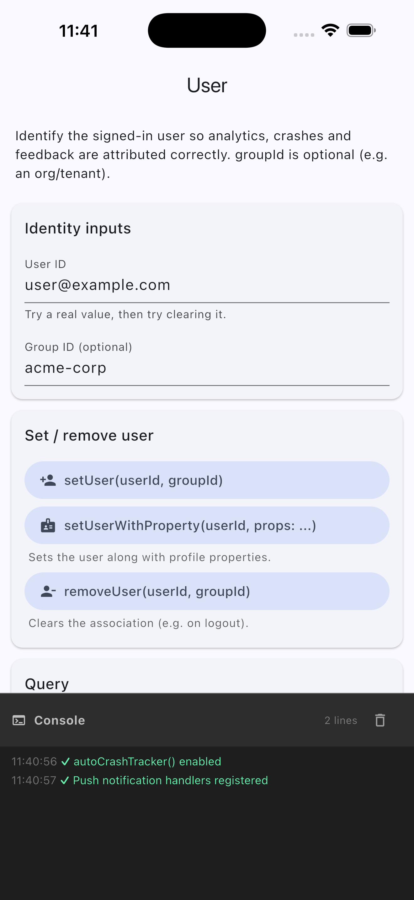
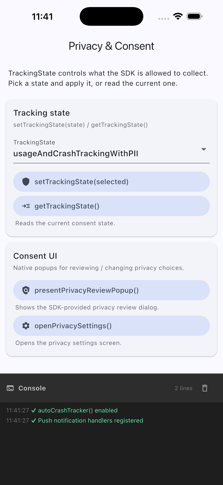
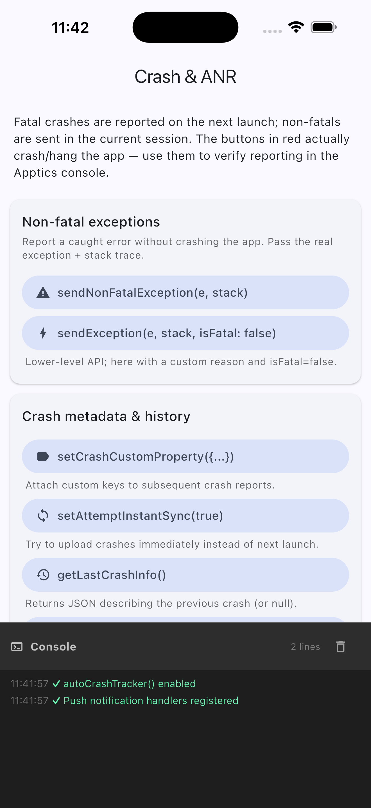
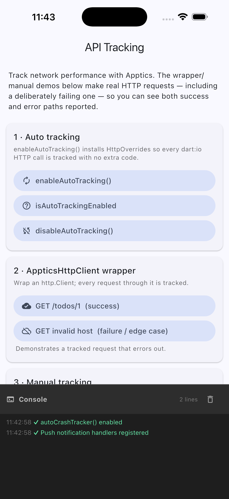
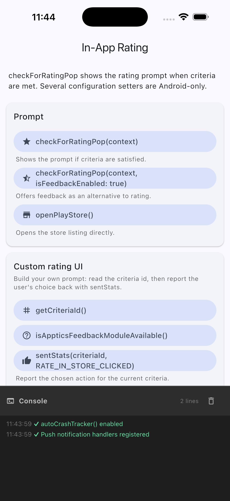

# Apptics Flutter — Sample App

A runnable reference app for the [`apptics_flutter`](https://www.zoho.com/apptics/) plugin. Each Apptics feature has its own screen with labelled controls; every button calls the real plugin API and prints the result to a live in-app console so you can see exactly what each call does.

---

## Screenshots

| | | |
|:--:|:--:|:--:|
| <br>**Home** | <br>**Identify User** | <br>**Analytics** |
| <br>**Privacy & Consent** | <br>**Crash & ANR** | <br>**Feedback & Logging** |
| <br>**API Tracking** | <br>**In-App Updates** | <br>**In-App Ratings** |
| <br>**Remote Config** | <br>**Push** | |

---

## Features showcased

| Feature | What the demo covers | Deep-dive |
|---------|----------------------|-----------|
| **Identify User** | `setUser`, `setUserWithProperty`, `removeUser`, `getUserProperties`, `isUserLoggedIn` | [refer/users.md](refer/users.md) |
| **Analytics** | Custom events, predefined events, screen tracking, `flush` | [refer/analytics.md](refer/analytics.md) |
| **Privacy & Consent** | `getTrackingState` / `setTrackingState`, consent popup, privacy settings | [refer/privacy.md](refer/privacy.md) |
| **Crash & ANR** | Auto crash tracker, non-fatal exceptions, custom properties, ANR controls | [refer/crash-tracking.md](refer/crash-tracking.md) |
| **Feedback & Logging** | Feedback / bug-report forms, shake-to-send, `AppticsLogs`, diagnostics | [refer/feedback.md](refer/feedback.md) |
| **API Tracking** | Auto tracking, `AppticsHttpClient`, `AppticsDioInterceptor`, manual tracking, URL exclusion | [refer/api-tracking.md](refer/api-tracking.md) |
| **In-App Updates** | `checkAndUpdateAlert`, `getInAppUpdateData` — driven by console config | [refer/in-app-updates.md](refer/in-app-updates.md) |
| **In-App Ratings** | `checkForRatingPop`, custom prompt, store redirect — driven by console config | [refer/in-app-ratings.md](refer/in-app-ratings.md) |
| **Remote Config** | `getStringValue`, custom condition values, `hardReset` | [refer/remote-config.md](refer/remote-config.md) |
| **Push** | Background + foreground handlers, FCM (Android) / APNs (iOS) | [refer/push.md](refer/push.md) |

---

## Prerequisites

- **Flutter** ≥ 3.29 and the Dart SDK that ships with it.
- An **Apptics account** with a registered app on the [Apptics console](https://www.zoho.com/apptics/).
- **Android:** `minSdk 23`, `compileSdk 34`, JDK 17. Toolchain: Gradle 8.7, AGP 8.6.0, Kotlin 2.1.0.
- **iOS:** deployment target ≥ 13.0, CocoaPods, Xcode.

> Apptics supports **Android and iOS only**. Running on macOS will fail soft with `MissingPluginException`.

---

## Setup

### 1. Clone and install

```bash
git clone <this-repo-url>
cd Apptics-Demo/flutter
flutter pub get
```

### 2. Place your Apptics config files

**Android** — create `android/app/apptics-config.json` (next to `app/build.gradle`):

```json
{
  "zak": "<your-app-zak-key>",
  "bundleid": "com.example.sample",
  "serviceurl": "https://sdk-apptics.zoho.com",
  "syncinterval": 60
}
```

**iOS** — create `ios/apptics-config.plist` and reference it from `ios/Runner/Info.plist`:

```xml
<key>AP_INFOPLIST_FILE</key>
<string>apptics-config.plist</string>
```

| Key (Android / iOS) | Value |
|---------------------|-------|
| `zak` / `API_KEY` | Your app key from the Apptics console. |
| `bundleid` / `BUNDLE_ID` | Must match your `applicationId` / bundle identifier. |
| `serviceurl` / `SERVER_URL` | Data-center URL — `.com`, `.in`, `.eu`, etc. |
| `syncinterval` | Seconds between background syncs. |

Download both files from the Apptics console → your app → **Quick Start**.

### 3. Run

```bash
cd ios && pod install && cd ..   # iOS only
flutter run
```

Tap any card on the home screen to open a feature demo, then watch the console at the bottom.

---

## Web Console setup for specific features

Most features work as soon as the app is running. Two features — **In-App Updates** and **In-App Ratings** — are driven by configuration you set on the Apptics console. Without it, the prompts will not appear.

### In-App Updates

Go to **Developer → In-app update** → select your app → **Configure**. Set the version to promote, alert type (flexible / immediate / force), OS/SDK minimum, and reminder interval, then **Publish**. The SDK checks this config when `checkAndUpdateAlert(context)` is called and shows the dialog if the installed version is below the target.

### In-App Ratings

Go to **Developer → Growth → In-app rating** → select your app and platform → **Configure**. Choose the app versions, a mode (score-based or hit-based), and optional anchor points, then **Save**. The SDK evaluates the criteria when `checkForRatingPop(context)` is called and shows the prompt automatically when they are met.

---

## Learn more

- Apptics product page: <https://www.zoho.com/apptics/>
- SDK resources: <https://www.zoho.com/apptics/resources/SDK/>
- Per-feature deep dives: [`refer/`](refer/)
