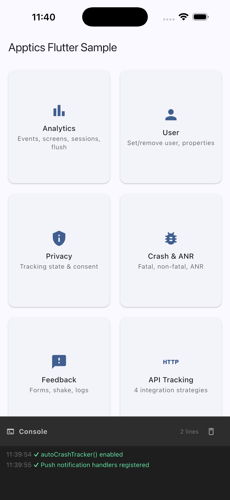
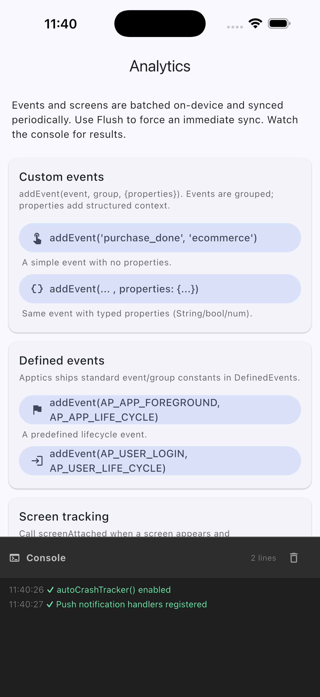
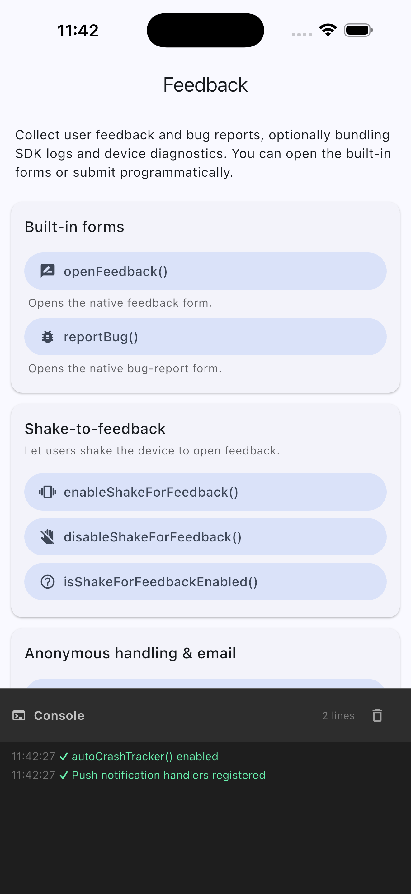
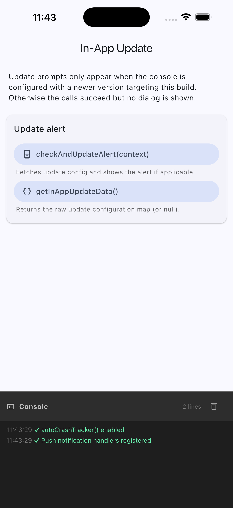
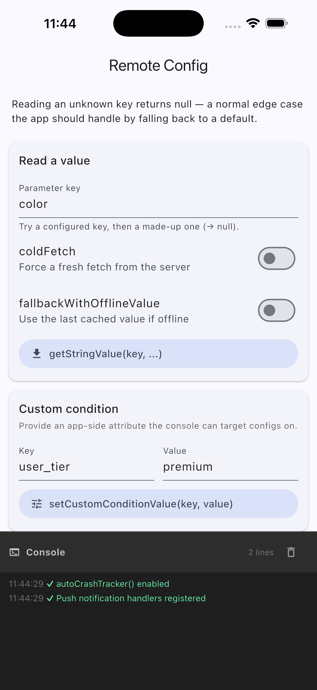
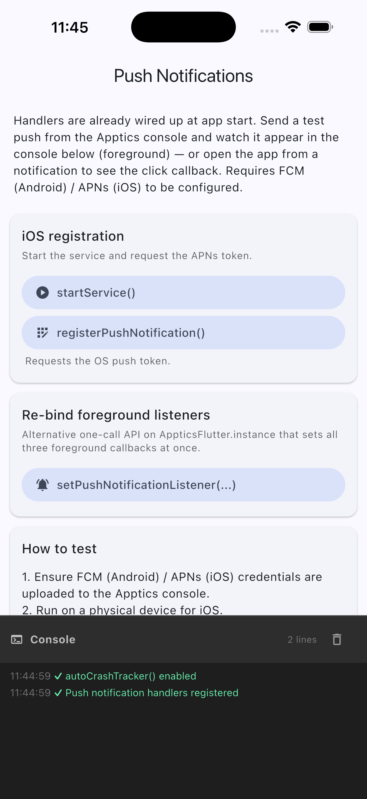
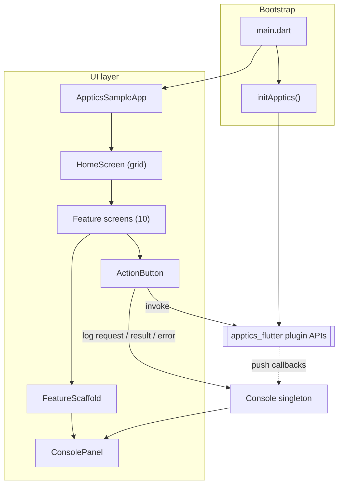
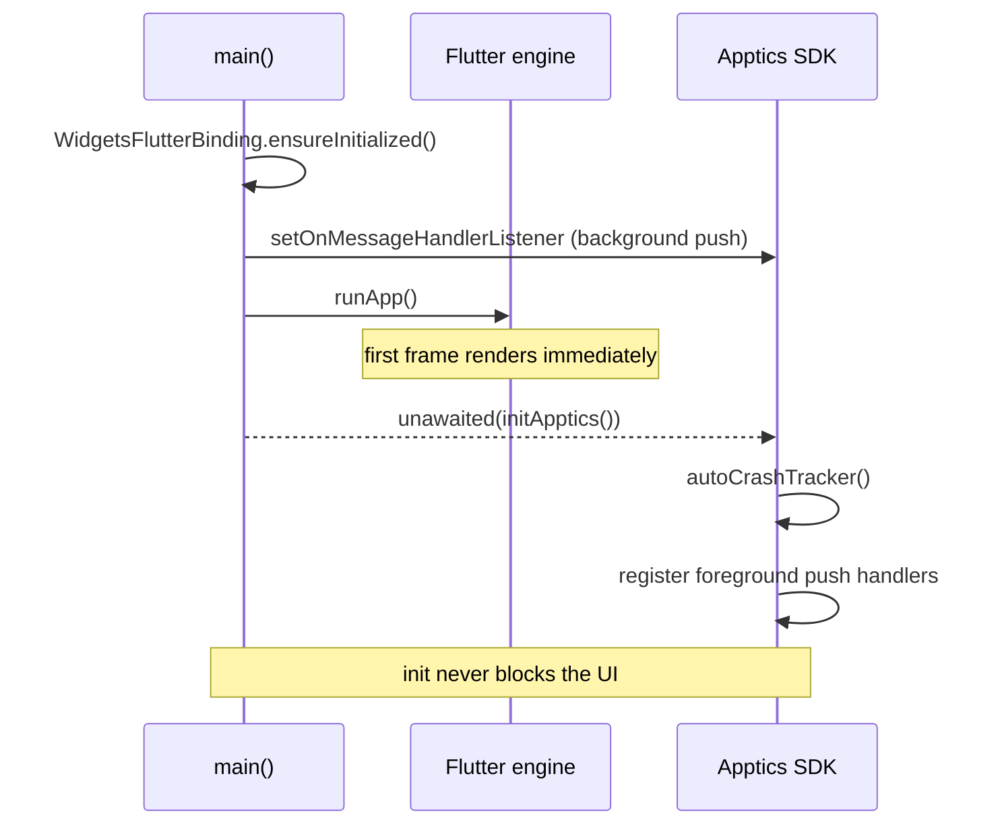

# Apptics Flutter — Sample App

A complete, runnable reference app for the [`apptics_flutter`](https://www.zoho.com/apptics/)
plugin. Every Apptics module has its own screen with labelled controls; each button calls the
**real** plugin API and reports the request, response, and any error to a live in-app **console** —
so you can see exactly what each call does, including success, failure, and edge cases.

> This sample exercises **API call tracking**, added in plugin `0.0.14`. The latest version on
> pub.dev is `0.0.13`, so the sample depends on the plugin via a **local path** (see
> [Setup](#setup--configuration-guide)). A normal app would use `apptics_flutter: ^0.0.13` and skip
> the API-tracking screen until 0.0.14 ships.

<p align="center">
  
  <br>
  <em>Home screen: a tile per Apptics module, with the shared live console pinned to the bottom.</em>
</p>

---

## Contents

- [Screenshots](#screenshots)
- [Features showcased](#features-showcased)
- [Prerequisites](#prerequisites)
- [Setup & Configuration Guide](#setup--configuration-guide)
- Features:
  [Identify User](#identify-user) ·
  [Analytics](#analytics) ·
  [Privacy & Consent](#privacy--consent) ·
  [Crash & ANR](#crash--anr) ·
  [Feedback & Logging](#feedback--logging) ·
  [API Tracking](#api-tracking) ·
  [In-App Updates](#in-app-updates) ·
  [In-App Ratings](#in-app-ratings) ·
  [Remote Config](#remote-config) ·
  [Push](#push)
- [Architecture](#architecture)
- [Project structure](#project-structure)
- [Troubleshooting & notes](#troubleshooting--notes)
- [Learn more](#learn-more)

---

## Screenshots

Captured on the iOS simulator (iPhone 17 Pro Max). One screen per Apptics feature, plus the home screen.

| | | |
|:--:|:--:|:--:|
| <br>**Home** | <br>**Identify User** | <br>**Analytics** |
| <br>**Privacy & Consent** | <br>**Crash & ANR** | <br>**Feedback & Logging** |
| <br>**API Tracking** | <br>**In-App Updates** | <br>**In-App Ratings** |
| <br>**Remote Config** | <br>**Push** | |

---

## Features showcased

| Group | Screen | Apptics APIs |
|-------|--------|--------------|
| Identity | Identify user | `setUser`, `setUserWithProperty` (+ `AppticsUserPropertyBuilder`), `removeUser`, `getUserProperties`, `isUserLoggedIn` |
| Analytics | Events & screens | `addEvent` (custom + `DefinedEvents`), `screenAttached`/`screenDetached`, `setDefaultLanguage`, `flush` |
| Privacy | Consent & tracking state | `getTrackingState`, `setTrackingState`, `presentPrivacyReviewPopup`, `openPrivacySettings` |
| Diagnostics | Crash & ANR | `autoCrashTracker`, `sendNonFatalException`, `sendException`, `setCrashCustomProperty`, `getLastCrashInfo`, ANR toggles, forced crash |
| Feedback | Feedback & logging | feedback / bug-report UI, shake-to-send, `sendFeedback`/`sendBugReport`, `AppticsLogs.writeLog`, diagnostics |
| Monitoring | API tracking | auto tracking, `AppticsHttpClient`, `AppticsDioInterceptor`, manual `startApiTracking`/`endApiTracking`, URL exclusion |
| Engagement | **In-app updates** | `checkAndUpdateAlert`, `getInAppUpdateData` |
| Engagement | **In-app ratings** | `checkForRatingPop`, `getCriteriaId`, `sentStats`, `openPlayStore`, config setters |
| Configuration | Remote config | `getStringValue` (+ `coldFetch` / offline fallback), `setCustomConditionValue`, `hardReset` |
| Messaging | Push | background + foreground handlers, `setPushNotificationListener`, iOS `registerPushNotification`/`startService` |

---

## Prerequisites

- **Flutter** ≥ 3.29 (developed/verified with 3.44) and the Dart SDK that ships with it.
- An **Apptics account** with a registered app on the [Apptics console](https://www.zoho.com/apptics/).
  The console is where you configure rating criteria, target update versions, remote-config values, etc.
- **Android:** `minSdk 23`, `compileSdk 34`, JDK 17. Toolchain pinned in this repo: Gradle 8.7, AGP 8.6.0, Kotlin 2.1.0.
- **iOS:** deployment target ≥ 13.0, CocoaPods, Xcode.

> Apptics ships native implementations for **Android and iOS only** — run the sample on those
> platforms. The project keeps `android/`, `ios/` and `macos/`; on macOS the bootstrap fails soft
> (`MissingPluginException`).

---

## Setup & Configuration Guide

Five steps to get the sample running and to wire **In-App Rating** and **In-App Update** to your own
Apptics app. (The API for every feature is in the reference sections further down.)

### Step 1 — Get & open the project

```bash
git clone <this-repo-url>
cd flutter-sdk-sample
flutter pub get
```

The plugin is referenced via a local path next to this repo
(`apptics_flutter: { path: ../apptics-flutter }` in `pubspec.yaml`); clone it alongside, or switch
to the published version.

### Step 2 — Place your Apptics config files

There is **no Dart-side `initialize(apiKey: …)` call** — credentials come entirely from native
config files the SDK reads at launch.

**Android** — `android/app/apptics-config.json` (next to `app/build.gradle`):

```json
{
  "zak": "<your-app-zak-key>",
  "bundleid": "com.example.sample",
  "serviceurl": "https://sdk-apptics.zoho.com",
  "syncinterval": 60
}
```

**iOS** — `ios/apptics-config.plist` with keys `API_KEY`, `BUNDLE_ID`, `SERVER_URL`, referenced from
`ios/Runner/Info.plist`:

```xml
<key>AP_INFOPLIST_FILE</key>
<string>apptics-config.plist</string>
```

| Key (Android / iOS) | What to put |
|---------------------|-------------|
| `zak` / `API_KEY` | Your app key from the Apptics console. |
| `bundleid` / `BUNDLE_ID` | **Must match** your `applicationId` / bundle identifier. |
| `serviceurl` / `SERVER_URL` | Data-center URL for your account — `.com`, `.in`, `.eu`, etc. |
| `syncinterval` | Seconds between background syncs (e.g. `60`). |

Download both files from the Apptics console → your app → **Settings → SDK Integration**.

### Step 3 — Run the app

```bash
flutter pub get
cd ios && pod install && cd ..   # iOS only
flutter run                       # pick an Android/iOS device or simulator
```

The home screen lists every feature — tap a card to open its demo screen, then watch the console at
the bottom.

### Step 4 — Configure In-App Rating

The rate-us popup is driven by **criteria you set on the console**; the app just shows it.

**(A) On the Apptics console** — **Developer → Growth → In-app rating** → pick your app/platform →
**Configure**: choose the app versions, a **Mode** (score-based or hit-based), optional anchor
points, then **Save**. When a user meets the criteria the SDK shows the popup automatically.

**(B) In code (optional)** — tune timing or trigger it yourself:

```dart
import 'package:apptics_flutter/rateus/apptics_in_app_rating.dart';

// Android-only tuning:
await AppticsInAppRating.instance.setDaysBeforeShowingPopupAgain(10);
await AppticsInAppRating.instance.setMaxTimesToShowPopup(3);

// Show now, only if the console criteria are satisfied:
await AppticsInAppRating.instance.checkForRatingPop(context);
```

→ Full options in the [In-App Ratings](#in-app-ratings) reference.

### Step 5 — Configure In-App Update

**(A) On the Apptics console** — **Developer → In-app update** → pick your app → **Configure**:
choose the latest version to promote, a minimum OS/SDK version, an alert type (flexible / immediate /
force), upload your `language.json` messages, set reminder intervals, preview, and **Publish**.

**(B) In code** — call the check with a `BuildContext`; if the console version is newer than the
installed build, Apptics shows the upgrade dialog:

```dart
import 'package:apptics_flutter/appupdate/apptics_in_app_update.dart';

await AppticsInAppUpdates.instance.checkAndUpdateAlert(context);
```

→ More in the [In-App Updates](#in-app-updates) reference.

### How the SDK is wired (already done in this project)

You don't need to change any of this to run the sample — it's here for when you copy the setup.

**`pubspec.yaml`** depends on the plugin (path dependency here; use the published version in a real app):

```yaml
dependencies:
  apptics_flutter:
    path: ../apptics-flutter   # or: apptics_flutter: ^0.0.13
  http: ^1.1.0                 # used by the API-tracking demo
```

**Android** — `android/build.gradle` adds the Zoho Maven repo + gradle plugin, and
`android/app/build.gradle` applies `apptics-plugin`:

```groovy
// android/build.gradle
buildscript {
  repositories { google(); mavenCentral(); maven { url "https://maven.zohodl.com/" } }
  dependencies { classpath 'com.zoho.apptics:apptics-plugin:0.2.5' }
}

// android/app/build.gradle
plugins { id "apptics-plugin" }
```

**iOS** — `ios/Podfile` pins the platform and runs the mandatory Apptics pre-build script *before*
Compile Sources:

```ruby
platform :ios, '13.0'
script_phase :name => 'Apptics pre build',
  :script => 'sh "./Pods/Apptics-SDK/scripts/run" --upload-symbols-for-configurations="Release, Appstore"',
  :execution_position => :before_compile
```

**`lib/main.dart`** registers the background push handler, then renders the UI **before**
initializing Apptics so a slow native call never blocks the first frame:

```dart
@pragma('vm:entry-point')
Future<void> appticsBackgroundMessageHandler(Map<String, dynamic> m) async { /* ... */ }

Future<void> main() async {
  WidgetsFlutterBinding.ensureInitialized();
  AppticsPushNotification.setOnMessageHandlerListener(appticsBackgroundMessageHandler);
  runApp(const AppticsSampleApp());   // render first
  unawaited(initApptics());           // crash + push init in the background
}
```

> `initApptics()` (in `lib/core/apptics_bootstrap.dart`) enables `autoCrashTracker()` and registers
> the foreground push handlers. **Don't `await` it before `runApp()`** — a native call that never
> returns (e.g. iOS push registration on a simulator) would block the first frame and leave a blank
> white screen.

---

## Identify User

Attribute analytics, crashes and feedback to a signed-in user, optionally with an org/tenant
`groupId` and a profile of properties. Demo: [`lib/screens/user_screen.dart`](lib/screens/user_screen.dart).

### API

```dart
import 'package:apptics_flutter/apptics_flutter.dart';
import 'package:apptics_flutter/apptics_user_property.dart';

await AppticsFlutter.instance.setUser('user@example.com', 'acme-corp');

final props = AppticsUserPropertyBuilder()
    .setFirstName('Ada')
    .setEmailAddress('ada@example.com')
    .setPlanType('enterprise')
    .addNumberProperty('seats', 25)
    .build();
await AppticsFlutter.instance.setUserWithProperty('ada@example.com', props: props);

final stored = await AppticsFlutter.instance.getUserProperties();   // Map?
final loggedIn = await AppticsFlutter.instance.isUserLoggedIn();    // bool?
await AppticsFlutter.instance.removeUser('ada@example.com');
```

| Method | What it does |
|--------|--------------|
| `setUser(userId, [groupId])` | Associates analytics with a user (+ optional group). |
| `setUserWithProperty(userId, {groupId, props})` | Sets the user with profile properties (builder). |
| `getUserProperties()` | Returns the stored property map (`null`/empty if none). |
| `isUserLoggedIn()` | Whether a user is currently set. |
| `removeUser(userId, [groupId])` | Clears the association (e.g. on logout). |

📖 Full guide: [refer/users.md](refer/users.md)

---

## Analytics

Record custom events with optional properties, track screen views, set the reported language, and
flush the queue on demand. Demo: [`lib/screens/analytics_screen.dart`](lib/screens/analytics_screen.dart).

### API

```dart
import 'package:apptics_flutter/apptics_flutter.dart';
import 'package:apptics_flutter/defined_events.dart';

AppticsFlutter.instance.addEvent('purchase_done', 'ecommerce',
    properties: {'item': 'Pro Plan', 'amount': 49.99});

// Predefined events/groups:
AppticsFlutter.instance.addEvent(DefinedEvents.AP_USER_LOGIN, DefinedEvents.AP_USER_LIFE_CYCLE);

AppticsFlutter.instance.screenAttached('CheckoutScreen');
AppticsFlutter.instance.screenDetached('CheckoutScreen');
await AppticsFlutter.instance.flush();   // upload now
```

| Method | What it does |
|--------|--------------|
| `addEvent(event, group, {properties})` | Records a custom event; properties are a `Map<String, dynamic>`. |
| `screenAttached(name)` / `screenDetached(name)` | Measures screen views & dwell time. |
| `setDefaultLanguage(lang)` | Sets the language reported with analytics. |
| `flush()` | Uploads queued events/screens/sessions immediately. |

📖 Full guide: [refer/analytics.md](refer/analytics.md)

---

## Privacy & Consent

Control what the SDK may collect via a [`TrackingState`], and surface Apptics' consent UIs. Demo:
[`lib/screens/privacy_screen.dart`](lib/screens/privacy_screen.dart).

### API

```dart
import 'package:apptics_flutter/apptics_flutter.dart';
import 'package:apptics_flutter/apptics_flutter_util.dart'; // TrackingState

await AppticsFlutter.instance.setTrackingState(TrackingState.usageAndCrashTrackingWithPII);
final state = await AppticsFlutter.instance.getTrackingState();   // TrackingState?

await AppticsFlutter.instance.presentPrivacyReviewPopup();
await AppticsFlutter.instance.openPrivacySettings();
```

| Method | What it does |
|--------|--------------|
| `getTrackingState()` / `setTrackingState(state)` | Reads / sets the consent level (what may be collected). |
| `presentPrivacyReviewPopup()` | Shows the SDK's privacy review dialog. |
| `openPrivacySettings()` | Opens the privacy settings screen. |

📖 Full guide: [refer/privacy.md](refer/privacy.md)

---

## Crash & ANR

Fatal crashes and ANRs are captured automatically once `autoCrashTracker()` runs; non-fatals and
custom metadata can be reported manually. Demo: [`lib/screens/crash_screen.dart`](lib/screens/crash_screen.dart).

### API

```dart
import 'package:apptics_flutter/crash_tracker/apptics_crash_tracker.dart';

await AppticsCrashTracker.instance.autoCrashTracker();   // enabled at startup

try {
  doRiskyThing();
} catch (e, s) {
  await AppticsCrashTracker.instance.sendNonFatalException(e, s);
}

await AppticsCrashTracker.instance.setCrashCustomProperty({'screen': 'Cart', 'items': 3});
final info = await AppticsCrashTracker.instance.getLastCrashInfo();   // String? (JSON)

// ANR — Android only:
await AppticsCrashTracker.instance.enableANR();
```

| Method | What it does |
|--------|--------------|
| `autoCrashTracker()` | Hooks `FlutterError.onError` + `PlatformDispatcher.onError`. |
| `sendNonFatalException(e, s)` / `sendException(e, s, {reason, isFatal})` | Reports a caught error. |
| `setCrashCustomProperty(map)` | Attaches custom keys to subsequent reports. |
| `getLastCrashInfo()` / `showLastSessionCrashedPopup()` | Previous-crash JSON / popup. |
| `setAttemptInstantSync(bool)` | Try uploading crashes immediately. |
| `enableANR` / `disableANR` / `isANREnabled` / `makeANR` | ANR controls (**Android only**; `makeANR` is for testing). |

📖 Full guide: [refer/crash-tracking.md](refer/crash-tracking.md)

---

## Feedback & Logging

Collect feedback and bug reports — via the built-in forms, shake-to-send, or programmatically —
optionally bundling SDK logs and diagnostics. Demo: [`lib/screens/feedback_screen.dart`](lib/screens/feedback_screen.dart).

### API

```dart
import 'package:apptics_flutter/feedback/apptics_feedback.dart';
import 'package:apptics_flutter/feedback/apptics_logs.dart';
import 'package:apptics_flutter/feedback/apptics_log_type.dart';

await AppticsFeedback.instance.openFeedback();   // built-in form
await AppticsFeedback.instance.enableShakeForFeedback();
await AppticsFeedback.instance.sendFeedback('Great app!', true /*logs*/, true /*diagnostics*/);

AppticsLogs.instance.writeLog('Checkout started', Log.info);
AppticsLogs.instance.addDiagnosticsInfo('App', 'build', '1.0.0+1');
```

| Method | What it does |
|--------|--------------|
| `openFeedback()` / `reportBug()` | Opens the native feedback / bug-report form. |
| `enableShakeForFeedback()` (+ `disable`/`is…Enabled`) | Shake gesture to open feedback. |
| `setEmailId(email)` / anonymous-alert toggles | Submitter identity handling. |
| `sendFeedback(msg, includeLogs, includeDiagnostics, {…})` / `sendBugReport(…)` | Submit programmatically. |
| `AppticsLogs.writeLog(msg, Log.level)` | Writes a log line (verbose/debug/info/warn/error). |
| `addDiagnosticsInfo(heading, key, value)` / `resetLogsAndDiagnostics()` | Attach / clear diagnostics. |

📖 Full guide: [refer/feedback.md](refer/feedback.md)

---

## API Tracking

Measure network latency, status codes and failures. Four integration strategies — pick what fits your
HTTP stack. Demo: [`lib/screens/api_tracking_screen.dart`](lib/screens/api_tracking_screen.dart).

### API

```dart
import 'package:apptics_flutter/api_tracker/apptics_api_tracker.dart';
import 'package:apptics_flutter/api_tracker/apptics_http_client.dart';
import 'package:http/http.dart' as http;

// 1) Automatic (HttpOverrides) — zero per-call code:
AppticsApiTracker.instance.enableAutoTracking();

// 2) Wrap the http client:
final client = AppticsHttpClient(http.Client());
final res = await client.get(Uri.parse('https://api.example.com/users'));
client.close();

// 3) Manual:
final id = await AppticsApiTracker.instance.startApiTracking(url: '…', method: 'POST');
await AppticsApiTracker.instance.endApiTracking(trackId: id, statusCode: 201);

// 4) Exclude noisy endpoints:
AppticsApiTracker.instance.excludedUrlPatterns.add('/healthz');
```

| Method | What it does |
|--------|--------------|
| `enableAutoTracking()` / `disableAutoTracking()` / `isAutoTrackingEnabled` | Auto-track all dart:io HTTP calls. |
| `AppticsHttpClient(inner)` | Tracking wrapper for the `http` package. |
| `AppticsDioInterceptor()` | Interceptor for the `dio` package. |
| `startApiTracking(…)` / `endApiTracking(…)` / `trackApiCall(…)` | Manual tracking for any transport. |
| `excludedUrlPatterns` | Substrings to skip. |

📖 Full guide: [refer/api-tracking.md](refer/api-tracking.md)

---

## In-App Updates

Show update prompts driven by your console configuration (flexible / immediate / force). Demo:
[`lib/screens/in_app_update_screen.dart`](lib/screens/in_app_update_screen.dart).

### API

```dart
import 'package:apptics_flutter/appupdate/apptics_in_app_update.dart';

await AppticsInAppUpdates.instance.checkAndUpdateAlert(context);
final data = await AppticsInAppUpdates.instance.getInAppUpdateData();   // Map?
```

| Method | What it does |
|--------|--------------|
| `checkAndUpdateAlert(context)` | Fetches update config and shows the alert if applicable. |
| `getInAppUpdateData()` | Returns the raw update configuration map (or `null`). |

📖 Full guide: [refer/in-app-updates.md](refer/in-app-updates.md)

---

## In-App Ratings

Show the rating prompt when console-defined criteria are met, or build a custom prompt. Demo:
[`lib/screens/rating_screen.dart`](lib/screens/rating_screen.dart).

### API

```dart
import 'package:apptics_flutter/rateus/apptics_in_app_rating.dart';
import 'package:apptics_flutter/rateus/popup_action.dart';

await AppticsInAppRating.instance.checkForRatingPop(context, isFeedbackEnabled: true);

// Custom UI: read the criteria id, report the user's choice:
final id = await AppticsInAppRating.instance.getCriteriaId() ?? 0;
await AppticsInAppRating.instance.sentStats(id, PopupAction.RATE_IN_STORE_CLICKED);

await AppticsInAppRating.instance.openPlayStore();
```

| Method | What it does |
|--------|--------------|
| `checkForRatingPop(context, {isFeedbackEnabled})` | Shows the prompt if criteria are satisfied. |
| `getCriteriaId()` / `sentStats(id, PopupAction)` / `updateRatingShown()` | Build & report a custom prompt. |
| `openPlayStore()` | Opens the store listing. |
| `setMaxTimesToShowPopup`, `setDaysBeforeShowingPopupAgain`, … | Tuning (**Android only**). |

📖 Full guide: [refer/in-app-ratings.md](refer/in-app-ratings.md)

---

## Remote Config

Read server-driven values defined on the console; target them with custom conditions. Demo:
[`lib/screens/remote_config_screen.dart`](lib/screens/remote_config_screen.dart).

### API

```dart
import 'package:apptics_flutter/remoteconfig/apptics_remote_config.dart';

final color = await AppticsRemoteConfig.instance.getStringValue('color') ?? 'blue';

await AppticsRemoteConfig.instance.setCustomConditionValue('user_tier', 'premium');
await AppticsRemoteConfig.instance.hardReset();
```

| Method | What it does |
|--------|--------------|
| `getStringValue(key, {coldFetch, fallbackWithOfflineValue})` | Reads a value; unknown key → `null` (use a default). |
| `setCustomConditionValue(key, value)` | Provides an app-side attribute the console can target on. |
| `hardReset()` | Clears cached config and restores defaults. |

📖 Full guide: [refer/remote-config.md](refer/remote-config.md)

---

## Push

Handle push notifications in the foreground and background. Requires FCM (Android) / APNs (iOS)
configured in the Apptics console. Demo: [`lib/screens/push_screen.dart`](lib/screens/push_screen.dart).

### API

```dart
import 'package:apptics_flutter/push_notification/apptics_push_notification.dart';

// Background — top-level, registered in main() before runApp():
@pragma('vm:entry-point')
Future<void> bgHandler(Map<String, dynamic> m) async { /* ... */ }
AppticsPushNotification.setOnMessageHandlerListener(bgHandler);

// Foreground:
await AppticsPushNotification.initialize(
  onMessageReceived: (msg) {},
  onNotificationClick: (action, payload) {},
  onNotificationActionClick: (id, action, payload) {},
);
```

| Method | What it does |
|--------|--------------|
| `setOnMessageHandlerListener(fn)` | Registers the background message handler. |
| `initialize({onMessageReceived, onNotificationClick, onNotificationActionClick})` | Foreground handlers. |
| `AppticsFlutter.instance.setPushNotificationListener({…})` | One-call alternative for the three callbacks. |
| `registerPushNotification()` / `startService()` | **iOS only** — request the APNs token / start messaging. |

📖 Full guide: [refer/push.md](refer/push.md)

---

## Architecture

The UI calls the real plugin through `ActionButton`, which routes every result into an app-wide
`Console` rendered by `ConsolePanel` at the bottom of each screen.



**Action → console data flow** — every button follows the same path:

```mermaid
flowchart LR
    tap["User taps ActionButton"] --> req["log: → apiName(...)"]
    req --> call["await plugin API"]
    call -->|"returns value / null"| ok["log: ✓ result"]
    call -->|"throws"| err["log: ✗ error"]
    ok --> panel["ConsolePanel re-renders live"]
    err --> panel
```

**Startup sequence** — render first, initialize after (the white-screen fix):



---

## Project structure

```
lib/
  main.dart                      # bootstrap: binding, bg push handler, runApp, initApptics()
  core/
    console.dart                 # Console: app-wide observable log buffer (ChangeNotifier singleton)
    log_entry.dart               # LogEntry data + LogLevel enum
    apptics_bootstrap.dart       # initApptics(): crash tracking + foreground push (platform-guarded)
  widgets/
    feature_scaffold.dart        # AppBar + body + persistent ConsolePanel (reused by every screen)
    console_panel.dart           # live, colour-coded, auto-scrolling console view
    action_button.dart           # runs an async plugin call, logs request/result/error
    section_card.dart            # titled, self-documenting group of controls
  models/
    feature.dart                 # Feature descriptor used to build the home grid
  screens/                       # one screen per Apptics module (see links above)

docs/screenshots/                # screenshots embedded in this README
refer/                           # per-feature deep-dive guides
```

---

## Troubleshooting & notes

- **`MissingPluginException` for every call** — you're on web/desktop. Apptics is Android/iOS only.
- **No data in the Apptics console** — wrong data-center `serviceurl`/`SERVER_URL`, or the
  `bundleid`/`BUNDLE_ID` doesn't match your app id. Re-download config for the correct region.
- **iOS: SDK "not configured" at runtime** — the `Apptics pre build` script phase must run *before*
  Compile Sources, and `AP_INFOPLIST_FILE` must be set in `Info.plist`.
- **`pod install` fails on the Flutter min deployment target** — set `platform :ios, '13.0'` in the Podfile.
- **Gradle "version is lower than Flutter's minimum"** — this repo pins Gradle 8.7 / AGP 8.6.0 / Kotlin 2.1.0.
- **Blank white screen on launch** — don't `await initApptics()` before `runApp()`; render first, init after.
- **ANR / `makeANR` does nothing** — ANR tracking is **Android only**.
- **Rating / update prompt never appears** — those depend on server-side criteria / a newer configured version.

---

## Learn more

- Apptics product page: <https://www.zoho.com/apptics/>
- Apptics SDK resources: <https://www.zoho.com/apptics/resources/SDK/>
- Per-feature deep dives: [`refer/`](refer/)
