# Apptics React Native — Sample App

A runnable reference app for the [`@zoho_apptics/apptics-react-native`](https://www.npmjs.com/package/@zoho_apptics/apptics-react-native) library. Each Apptics feature has its own screen with labelled controls; every button calls the real SDK API and prints the result to a live in-app console so you can see exactly what each call does.

- **App id / bundle id:** `com.zoho.apptics.rnsample`
- **Apptics library:** `0.19.0-beta.1` · **React Native:** `0.86.2` (New Architecture) · **Gradle plugin:** `0.2.6-beta`

---

## Screenshots

| | | |
|:--:|:--:|:--:|
| 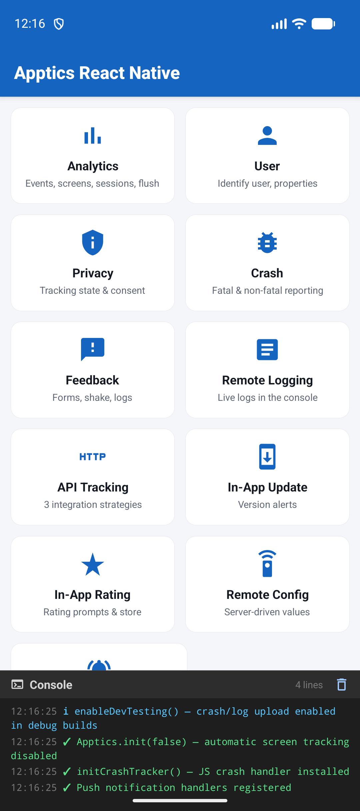<br>**Home** | 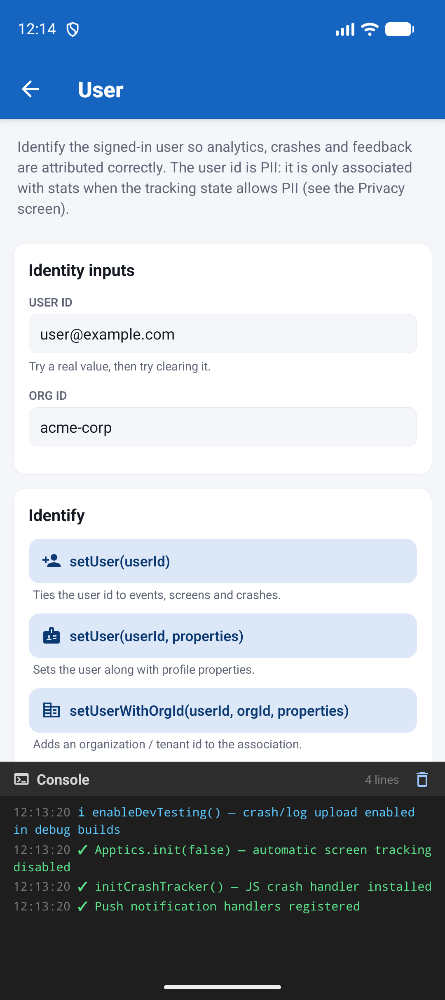<br>**Identify User** | 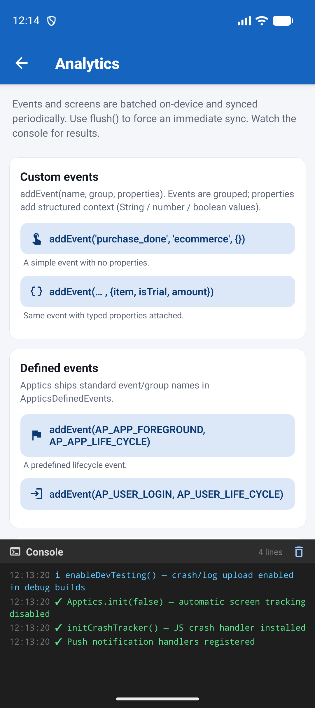<br>**Analytics** |
| 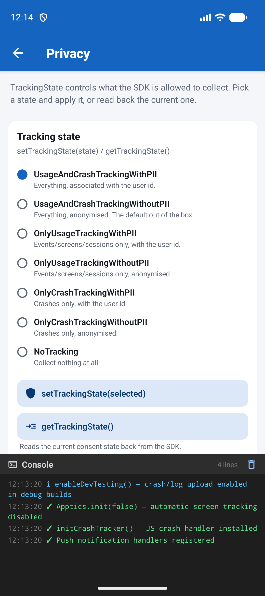<br>**Privacy & Consent** | 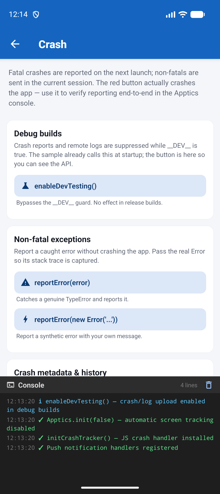<br>**Crash** | 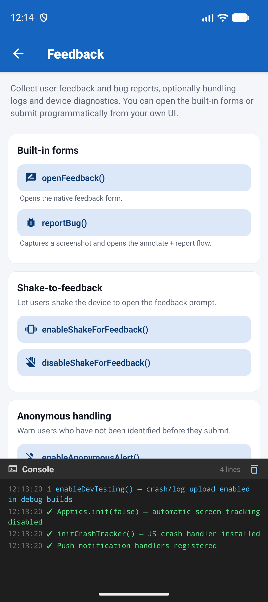<br>**Feedback** |
| 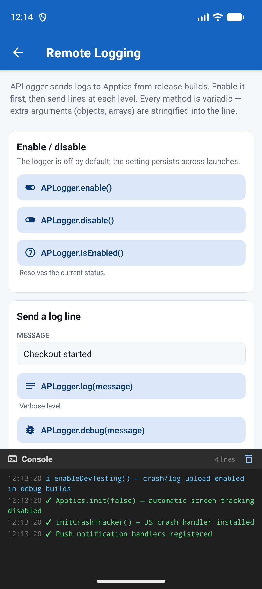<br>**Remote Logging** | 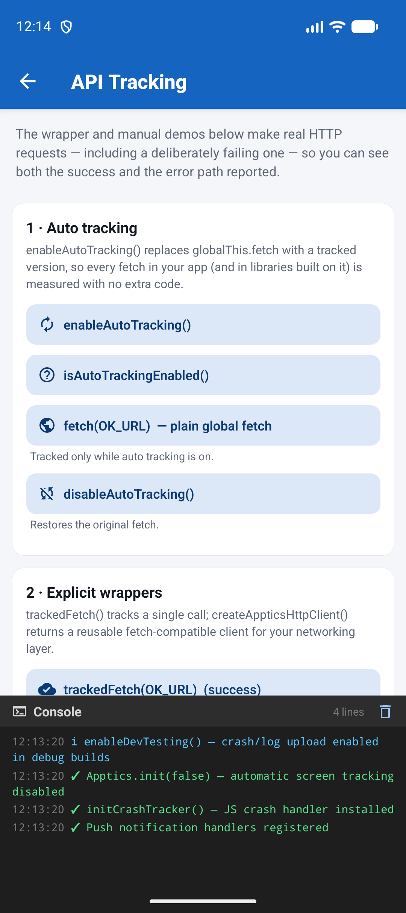<br>**API Tracking** | 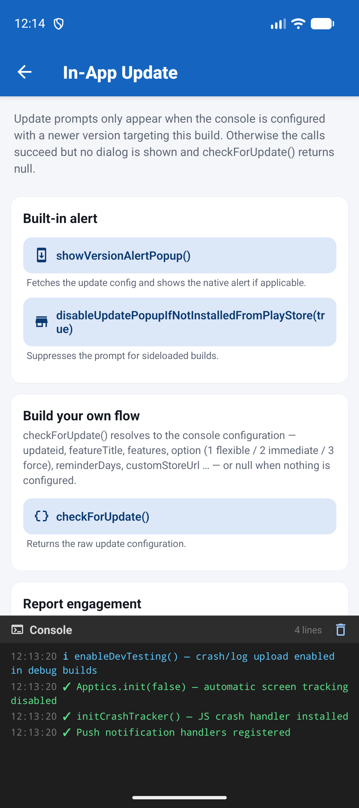<br>**In-App Updates** |
| 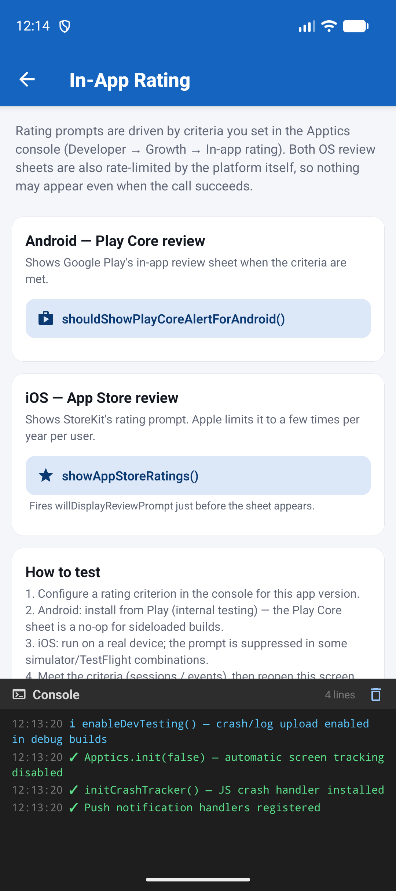<br>**In-App Ratings** | 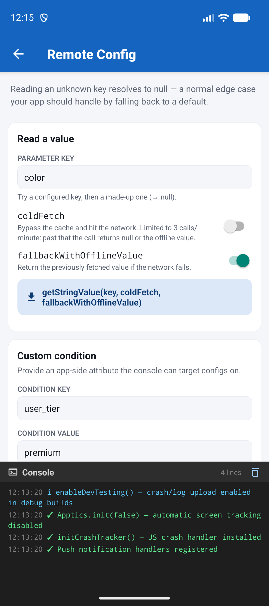<br>**Remote Config** | 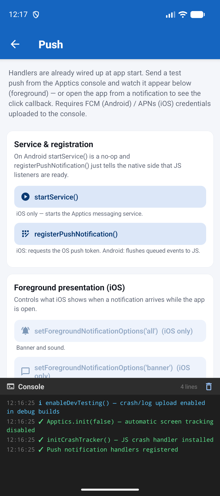<br>**Push** |

---

## Features showcased

| Feature | What the demo covers | Deep-dive |
|---------|----------------------|-----------|
| **Analytics** | `addEvent` with properties, `AppticsDefinedEvents`, screen tracking, `flush` | [refer/analytics.md](refer/analytics.md) |
| **User** | `setUser`, `setUserWithOrgId`, user properties, `isUserLoggedIn` | [refer/users.md](refer/users.md) |
| **Privacy** | All 7 `TrackingState` values, `getTrackingState`, consent popups, `openPrivacySettings` | [refer/privacy.md](refer/privacy.md) |
| **Crash** | `initCrashTracker`, `reportError`, `setCrashCustomProperty`, a real fatal crash | [refer/crash-tracking.md](refer/crash-tracking.md) |
| **Feedback** | Feedback / bug-report forms, shake-to-send, programmatic submission, logs & diagnostics | [refer/feedback.md](refer/feedback.md) |
| **Remote Logging** | `APLogger` levels, enable / disable, structured payloads | [refer/remote-logging.md](refer/remote-logging.md) |
| **API Tracking** | Auto `fetch` patching, `trackedFetch`, custom client, manual tracking, URL exclusion | [refer/api-tracking.md](refer/api-tracking.md) |
| **In-App Update** | `showVersionAlertPopup`, `checkForUpdate`, `sendUpdateStat` — driven by console config | [refer/in-app-updates.md](refer/in-app-updates.md) |
| **In-App Rating** | Play Core / App Store review sheets, `willDisplayReviewPrompt` — driven by console config | [refer/in-app-ratings.md](refer/in-app-ratings.md) |
| **Remote Config** | `getStringValue` with `coldFetch` / offline fallback, custom conditions | [refer/remote-config.md](refer/remote-config.md) |
| **Push** | Foreground / click / action callbacks, iOS registration, presentation options | [refer/push.md](refer/push.md) |

---

## Prerequisites

- **Node** ≥ 22.11 and the [React Native environment](https://reactnative.dev/docs/environment-setup) for your platforms.
- An **Apptics account** with a registered app on the [Apptics console](https://www.zoho.com/apptics/).
- **Android:** JDK 17, `minSdk 24`, `compileSdk 36`.
- **iOS:** Xcode, CocoaPods, deployment target ≥ React Native's `min_ios_version_supported`.

> Apptics ships native implementations for **Android and iOS only**.

---

## Setup

### 1. Install

```bash
git clone <this-repo-url>
cd Apptics-Demo/react-native
npm install
```

### 2. Place your Apptics config files

Both files come from the Apptics console → your app → **Quick Start**. The repo ships placeholders in the right locations — overwrite them, keeping the filenames.

**Android** — `android/app/apptics-config.json`:

```json
{
  "zak": "<your-app-zak-key>",
  "bundleid": "com.zoho.apptics.rnsample",
  "serviceurl": "https://sdk-apptics.zoho.com",
  "syncinterval": 60
}
```

**iOS** — create `ios/apptics-config.plist` and reference it from `ios/Runner/Info.plist`:

```xml
<key>AP_INFOPLIST_FILE</key>
<string>apptics-config.plist</string>
```

| Key (Android / iOS) | Value |
|---------------------|-------|
| `zak` / `API_KEY` | Your app key from the Apptics console. |
| `bundleid` / `BUNDLE_ID` | Must match your `applicationId` / bundle identifier. |
| `serviceurl` / `SERVER_URL` | Data-center URL — `.com`, `.in`, `.eu`, etc. |
| `syncinterval` | Seconds between background syncs (Android). |

Download both files from the Apptics console → your app → **Quick Start**.

### 3. Run

```bash
npm start            # Metro, in its own terminal

npm run android

cd ios && pod install && cd ..
npm run ios
```

Tap any card on the home screen to open a feature demo, then watch the console at the bottom.

---

## Console setup for specific features

Most features work as soon as the app is running. Three — **In-App Updates**, **In-App Ratings** and **Remote Config** — are driven by configuration you set on the Apptics console. Without it the calls still succeed, but nothing appears.

### In-App Updates

**Developer → In-app update** → select your app → **Configure**. Set the version to promote, alert type (flexible / immediate / force), OS/SDK minimum, and reminder interval, then **Publish**. `showVersionAlertPopup()` shows the dialog when the installed version is below the target; `checkForUpdate()` returns the same configuration as data so you can build your own UI.

### In-App Ratings

**Developer → Growth → In-app rating** → select your app and platform → **Configure**. Choose the app versions, a mode (score-based or hit-based), and optional anchor points, then **Save**. Note that both platform review sheets are additionally rate-limited by the OS itself.

### Remote Config

**Developer → Remote config** → add parameters, values, and (optionally) conditions. Custom conditions are matched against values your app supplies via `setCustomCondition`.

---

## Learn more

- Apptics product page: <https://www.zoho.com/apptics/>
- SDK resources: <https://www.zoho.com/apptics/resources/SDK/>
- React Native push setup: <https://www.zoho.com/apptics/resources/SDK/react-native-push-notifications.html>
- Per-feature deep dives: [`refer/`](refer/)
